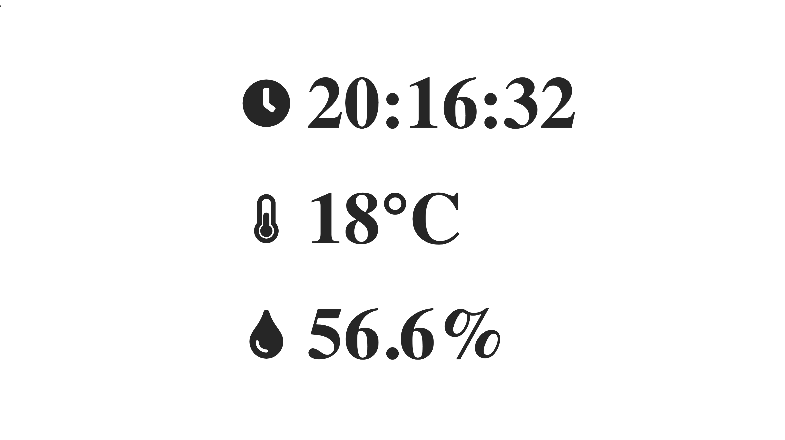

# Raspberry Pi Projects

## About The Project
11111


There are many interesting projects in raspberry pi community. This project is designed to demo some raspberry pi projects that finished by myself. This demo project contains both the backedn and the frontend. The backend is running on the raspberry pi and the front end running on a remote server. We use [fast reverse proxy](https://github.com/fatedier/frp) to communicate between the backend and the frontend. We open one port on the raspberry pi and another port on the remote server, at the same time, we are running frp for client and frp for server separatelly. For each time the server send a request to the raspberry pi through the port, the raspberry pi just send the requested data from this port to another port on the remote server. In this case, we can obtain all the information about the raspberry pi not only in the localhost but also in public network.

### Projects Listdfasdfadsfasd
* [Temperature And Humidity Viewer](./projects/Temperature-Humidity-Viewer/README.md)

## Built With
- Frontend : JavaScript and CSS
- Backend : Flask， PostgreSQL
- 3rd Party : React, antd, redux, react-icons, axios, moment, Adafruit_DHT, frp

jjjjjj
## Getting Started
The following instructions will get you a copy of this project and you can run the project on your local machine.

### Prerequisites
You need to install the following software to run this project locally:
* Node
* Npm
* react
* flask
* Adafruit_DHT
* frp

### Clone

* Clone this repo to your local machine using `https://github.com/konantian/Raspberry-Projects.git`

### Installation
> Install the package for frontend 

```shell
$ npm install 
```

> Install the package for backend 

```shell
$ pip install -r requirements.txt
```

## Usage
> Run frontend

```shell
$ npm start
```
> Run backend 

```shell
$ python3 app.py
```

If you are going to run this project on raspberry pi and remote server simultaneously, you also need to run frp for client on raspberry pi and frp for server on remote environment. Also, before you run frp, you need to make sure frpc.ini and frps.ini has been settled.

> Run frp on raspberry pi
```shell
$ ./frpc -c frpc.ini
```

> Run frp on remote server
```shell
$./frpc -c frps.ini
```
## Contributing

Contributions are what make the open source community such an amazing place to be learn, inspire, and create. Any contributions you make are **greatly appreciated**.

1. Fork the Project
2. Create your Feature Branch (`git checkout -b feature/AmazingFeature`)
3. Commit your Changes (`git commit -m 'Add some AmazingFeature'`)
4. Push to the Branch (`git push origin feature/AmazingFeature`)
5. Open a Pull Request

## License

Distributed under the MIT License. See `LICENSE` for more information.

## Contact

Yuan Wang - wang17@ualberta.ca

Project Link: [https://github.com/konantian/Raspberry-Projects](https://github.com/konantian/Raspberry-Projects)

## Acknowledgements
* [React](https://reactjs.org/)
* [antd](https://ant.design/)
* [redux](https://react-redux.js.org/introduction/quick-start)
* [react-redux](https://react-redux.js.org/)
* [react-icons](https://react-icons.github.io/react-icons/)
* [axios](https://github.com/axios/axios)
* [moment](https://momentjs.com/)
* [Adafruit_DHT](https://github.com/adafruit/Adafruit_Python_DHT)
* [fast reverse proxy](https://github.com/fatedier/frp)
