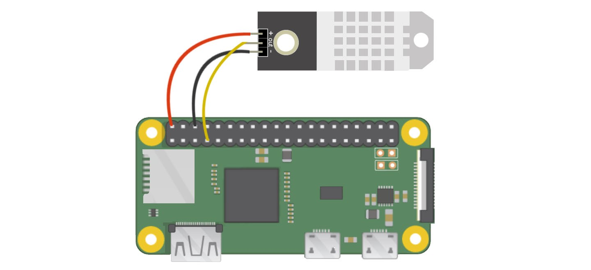

# Temperature and Humidity Viewer

## About The Project
In this project, we use DHT22 sensor to detect the current temperature and humidity indoor. After connectiong the sensor with the raspberry pi, a Python package called "Adafruit_DHT" is used to read the temperature and humidity data from the raspberry pi. 

## Prerequisites
### Hardware

* Raspberrypi
* Micro SD card
* Raspberrypi power supply
* DHT22 Temperature/Humidity Sensor

### Software
* Python
* Adafruit_DHT

### Assembly 
The DHT22 will have three pins(+, -, data) that we need to connect to the raspberry pi. We will use raspberry pi ZERO WH as example to show how to connection these three pins to pi. First, we connect the "+" pin to pin 2(the top right pin, 5V) on raspberry pi. The "-" pin we need to connect to pin 6(GND). The last pin is the data pin that used to send data from DHT22 to raspberrypi. We connect this to pin 7(GPIO4). Your connections should look like the following:


### Software Setup
> Install the packages to read the data
```shell
$ pip install -r requirements.txt
```

> Read data in python
```python3
import Adafruit_DHT
sensor = Adafruit_DHT.DHT22
pin = 4
humidity,temperature = Adafruit_DHT.read_retry(sensor, pin)
```